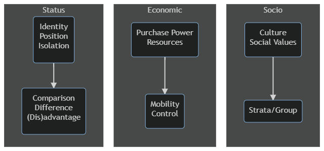

```{r setup, include=FALSE}
knitr::opts_chunk$set(echo = FALSE)
```

According to the seminal document The Solid Facts, individuals who experience financial disadvantage encounter greater morbidity and live shorter lives than those who are wealthier (Wilkinson & Marmot, 2003). These differences in health status not only constitute a key social injustice but also uncover the important role the social environment plays in determining health and well-being (Wilkinson & Marmot, 2003). While these issues will be unpacked in more detail throughout the course of HSH207 this trimester, the aim of this first topic is to introduce some of the key terms and concepts.

### What is SES?

>"...the social and economic position of a given individual, or group of individuals, within a larger society" (Australian Bureau of Statistics [ABS], 2011, p. 1). 

SES is most commonly considered a relative concept, which means that one does not have an 'absolute' socioeconomic status, but rather has a higher or lower SES in relation to others, depending on the measures being used. We can therefore describe relative socioeconomic advantage and disadvantage in terms of one's access to material and social resources, and their capacity to participate fully in society (ABS, (2008), as cited in ABS, 2011).



## How does SES relate to health?

### Social gradient

The **social gradient** refers to a person's SES, and their position relative to others in society based on their comparative wealth and ability to access various supportive factors to better health.

The social gradient refers to a continuous gradient across the whole population:

-   It means that life expectancy decreases and morbidity increases with each step down the 'ladder'.
-   Similarly, with every step up the 'ladder', life expectancy increases and morbidity decreases.

{height=50%, width=50%}

## Health inequalities and health inequities

<abbr title="The fair opportunity for everyone in society to attain their full health potential">**Health Equity**</abbr>

<abbr title="The differences in health status between population groups. For example, the difference in life expectancy between Aboriginal and Torres Strait Islanders and non-indigenous Australians.">**Health Inequality**</abbr>

Health inequities can be defined more broadly as differences in health status between population groups:

-   These inequities are "socially produced, systematic in their unequal distribution across the population, avoidable and unfair" (VicHealth, 2015, p. 4). 
-   The difference in life expectancy between Aboriginal and Torres Strait Islanders and non-Indigenous Australians therefore represents a health inequity, due to unequal access to the resources needed for optimal health and wellbeing.

To address the health inequities in our society, we need to focus on:

-   The the social conditions that shape health
-   The social processes that distribute them unequally across the population (or the social determinants of health inequities) (VicHealth, 2015).

The social determinants of health are considered to be largely responsible for health inequities (AIHW, 2018)

## Avoidable mortality

<abbr title="a simple and practical population-based method of counting untimely and unnecessary deaths from diseases for which effective public health and medical interventions are available.">**Avoidable mortality**</abbr>

An excess of deaths due to preventable causes should suggest shortcomings in the healthcare system that warrant further attention.

While avoidable mortality is generally declining across Australia, it is not doing so equally across the whole population:

-   higher avoidable mortality in men than women (gender)
-   higher in rural and remote areas compared to urban (geography)
-   higher avoidable mortality in most disadvantaged quintiles. (socio-economic status)